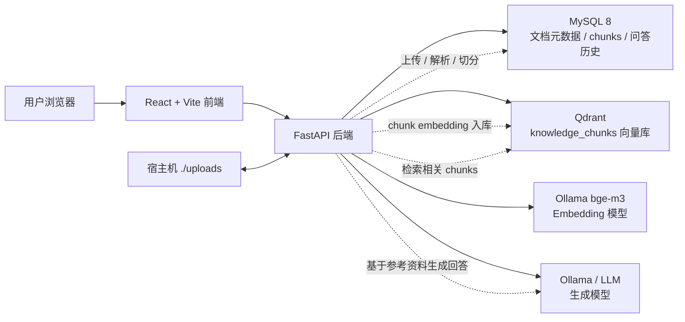

# ForgeMind RAG

ForgeMind RAG is a lightweight enterprise RAG system for document ingestion, parsing, embedding, vector search, and knowledge-based question answering.

ForgeMind RAG 是一个面向企业知识库场景的轻量级 RAG 系统，支持文档上传、解析切分、向量化、语义检索、知识库问答、来源引用与问答历史。


## 项目背景

企业内部通常存在大量分散的 PDF、Markdown、制度文档、项目说明和技术资料。传统全文搜索很难直接回答“这份资料里和某个问题最相关的内容是什么”，而直接把全部资料交给大模型又容易成本高、上下文超长、来源不可追踪。

本项目用一个最小可用的工程闭环验证企业知识库 RAG 流程：

- 文档进入系统后先结构化记录到 MySQL。
- 文档内容被解析、切分为 chunks。
- chunks 使用本地 Ollama `bge-m3` 生成向量并写入 Qdrant。
- 用户提问时先检索相关 chunks，再调用本地 LLM 基于参考资料生成回答。
- 前端展示答案、来源引用和问答历史，方便演示和验证效果。

## 项目预览


## 核心功能

- 简单登录：固定演示账号 `admin / admin123`。
- 文档上传：支持 PDF、Markdown，文件保存到 `uploads/` 挂载目录。
- 文档解析：PDF 使用 PyMuPDF，Markdown 直接读取文本。
- 文本切分：按约 800-1000 字符切分，保留 overlap 和 PDF 页码。
- 元数据入库：documents、document_chunks、qa_records 保存在 MySQL。
- 向量化：Ollama `bge-m3:latest` 作为 embedding 模型。
- 向量检索：Qdrant collection `knowledge_chunks` 保存 chunk 向量。
- RAG 问答：检索 top-k chunks 后调用 Ollama 聊天模型生成回答。
- 来源引用：回答下方展示文档名、页码、chunk index、score 和内容预览。
- 问答历史：保存最近问答记录，刷新页面后仍可查看。

## 技术栈

- Frontend: React + Vite + TypeScript
- Backend: FastAPI + SQLAlchemy + Uvicorn
- Database: MySQL 8
- Vector Database: Qdrant
- PDF Parser: PyMuPDF
- Embedding: Ollama `bge-m3:latest`
- LLM: Ollama `qwen2.5:7b` 或其他本地聊天模型
- Deployment: Docker Compose

## 系统架构



## 目录结构

```text
.
├── backend/              # FastAPI 后端
├── frontend/             # React + Vite + TypeScript 前端
├── uploads/              # 上传文件挂载目录
├── docs/                 # 演示、架构和测试问题文档
├── docker-compose.yml    # MySQL / Qdrant / backend / frontend
├── .env.example          # 环境变量模板
└── README.md             # GitHub 展示入口
```

## Docker Compose 启动方式

MacBook 只负责写代码和 Git 推送，不需要安装 Docker、MySQL、Python、Node.js、Qdrant 或 Ollama。i5 Ubuntu 服务器负责通过 Docker Compose 运行全部服务，建议部署目录使用 `forgemind-rag`。

```bash
git clone <your-github-repo-url> forgemind-rag
cd forgemind-rag
cp .env.example .env
docker compose up -d --build
```

常用检查命令：

```bash
docker compose ps
curl http://localhost:8000/health
curl http://localhost:8000/api/health
curl http://localhost:8000/api/qa/history
```

如果服务器已有旧 `.env`，请确认至少包含：

```env
APP_STAGE=Day 6
EMBEDDING_PROVIDER=ollama
EMBEDDING_MODEL=bge-m3:latest
EMBEDDING_API_BASE=http://192.168.9.39:11434
EMBEDDING_DIM=1024
LLM_PROVIDER=ollama
LLM_MODEL=qwen2.5:7b
LLM_API_BASE=http://192.168.9.39:11434
```

`bge-m3` 只用于 embedding，`qwen2.5` 或其他 Ollama 聊天模型用于生成最终回答。

## 当前访问地址

- 前端：http://192.168.3.93:5173
- 后端 API 文档：http://192.168.3.93:8000/docs
- Qdrant Dashboard：http://192.168.3.93:6333/dashboard

本机端口映射地址：

- Frontend: http://localhost:5173
- Backend API docs: http://localhost:8000/docs
- Qdrant dashboard: http://localhost:6333/dashboard

## Demo 操作流程

1. 打开前端页面并登录，账号 `admin`，密码 `admin123`。
2. 上传 PDF 或 Markdown 文档。
3. 在文档列表中点击“解析文档”。
4. 点击“查看切分结果”，检查 chunks 内容、页码和字符数。
5. 点击“向量化”，将 chunks 写入 Qdrant。
6. 在“知识库问答”区域输入问题或点击示例问题。
7. 查看 AI 回答和来源引用卡片。
8. 刷新页面后查看“问答历史”，点击历史问题回看答案和来源。

更完整的演示脚本见 [docs/demo-script.md](docs/demo-script.md)。

## 相关文档

- [系统架构说明](docs/architecture.md)
- [Demo 演示脚本](docs/demo-script.md)
- [演示测试问题](docs/testing-questions.md)

## 截图说明

建议 GitHub README 或面试展示中准备以下截图：

- 登录页：展示演示账号入口。
- 文档上传页：展示 PDF / Markdown 上传和文档列表。
- 解析结果页：展示 chunks、页码和字符数。
- 向量化状态：展示文档 embedding 状态。
- RAG 问答页：展示问题、回答、来源引用和 score。
- 问答历史页：展示刷新后仍可查看最近问答记录。

当前截图素材可放在 `docs/screenshots/` 下，保持按 Day 或功能分组。

## 当前进度

已完成：

- Day 1 工程初始化和 Docker Compose 可运行底座
- Day 2 简单登录、PDF / Markdown 上传、uploads 文件列表展示
- Day 3 PDF / Markdown 解析和文本切分
- Day 4 Ollama `bge-m3` embedding、Qdrant 入库、基础相似检索
- Day 5 基于检索 chunks 的 RAG 问答和来源引用
- Day 6 问答记录保存、最近 20 条历史展示、示例问题和前端体验优化
- Day 7 GitHub README、架构文档、演示脚本和测试问题整理

当前明确不包含：

- 多轮聊天
- 流式输出
- 用户权限 / RBAC
- 多租户
- MinIO
- Redis
- Celery
- Nginx

## 后续规划

- 接入真实用户体系和权限控制。
- 增加文档删除、重新解析、重新向量化能力。
- 增加更完善的文件类型支持，例如 Word、Excel、HTML。
- 加入检索参数调优、重排序和答案质量评估。
- 增加流式输出和多轮会话。
- 加入生产部署配置，例如 Nginx、HTTPS、备份和监控。

## 演示账号

- Username: `admin`
- Password: `admin123`
- Token: `day2-demo-token`
