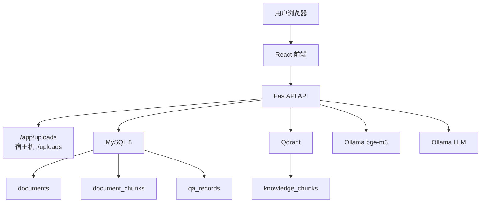
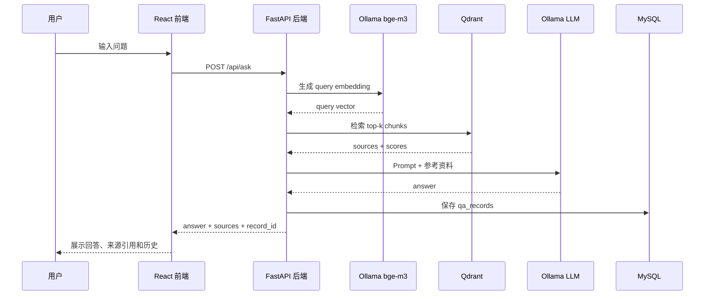

# Architecture

Enterprise Knowledge Agent 使用 Docker Compose 组织前端、后端、关系数据库和向量数据库。Ollama 可以运行在局域网内的服务器上，通过环境变量配置 API 地址。

## 组件说明

- React + Vite + TypeScript：提供登录、文档上传、解析/向量化操作、RAG 问答、来源引用和问答历史界面。
- FastAPI：提供 REST API，负责文件处理、文档解析、chunk 切分、embedding 调用、Qdrant 检索、LLM 调用和问答历史保存。
- MySQL 8：保存文档元数据、chunk 文本、向量化状态和问答历史。
- Qdrant：保存 chunk 向量和检索 payload。
- Ollama `bge-m3:latest`：生成文档 chunk 和用户问题的 embedding。
- Ollama LLM：生成最终回答，例如 `qwen2.5:7b`。
- uploads：宿主机目录，挂载到后端容器 `/app/uploads`。

## 架构图

## 数据流

### 文档入库流程

1. 用户在前端上传 PDF 或 Markdown。
2. FastAPI 将文件保存到 `/app/uploads`。
3. FastAPI 在 MySQL `documents` 表写入文档元数据。
4. 文档状态初始化为 `uploaded`，向量化状态初始化为 `pending`。

### 解析与切分流程

1. 用户点击“解析文档”。
2. FastAPI 将 `parse_status` 改为 `parsing`。
3. PDF 使用 PyMuPDF 提取文本，Markdown 直接读取文本。
4. 文本按约 800-1000 字符切分，并保留 100-150 字符 overlap。
5. chunks 写入 MySQL `document_chunks` 表。
6. 成功后文档状态改为 `parsed`，失败后改为 `failed`。

### 向量化流程

1. 用户点击“向量化”。
2. FastAPI 读取该文档下的所有 chunks。
3. Embedding service 调用 Ollama `bge-m3` 生成向量。
4. FastAPI 将向量和 payload 写入 Qdrant `knowledge_chunks`。
5. MySQL 中的 documents 和 document_chunks 更新 embedding 状态。

### RAG 问答流程

## 数据表

### documents

保存文档级元数据，包括文件名、文件路径、文件类型、文件大小、解析状态、chunk 数量、向量化状态、上传时间、解析时间和向量化时间。

### document_chunks

保存文档切分后的文本片段，包括 document_id、chunk_index、content、page_number、char_count、vector_id、embedding_status 和时间字段。

### qa_records

保存单轮问答历史，包括 question、answer、sources_json、model_name、top_k 和 created_at。

## 当前边界

当前版本聚焦最小可用 RAG 工程闭环，不包含：

- 多轮聊天
- 流式输出
- 用户权限 / RBAC
- 多租户
- MinIO
- Redis
- Celery
- Nginx
